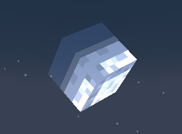
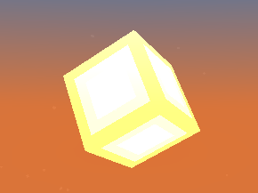

# 3D Celestials

3D Sun and Moon shader for Minecraft 1.17+

## How to install

 1. Press the green `Code` button and choose `Download ZIP`
 2. Extract the contents of the zip inside your resourcepacks folder
 3. Select the resourcepack ingame
 
## Examples

(The Sun and Moon rotates, but it's hard to show using images)

